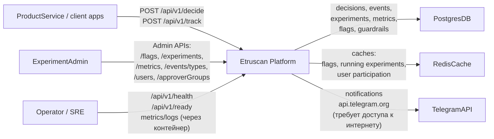
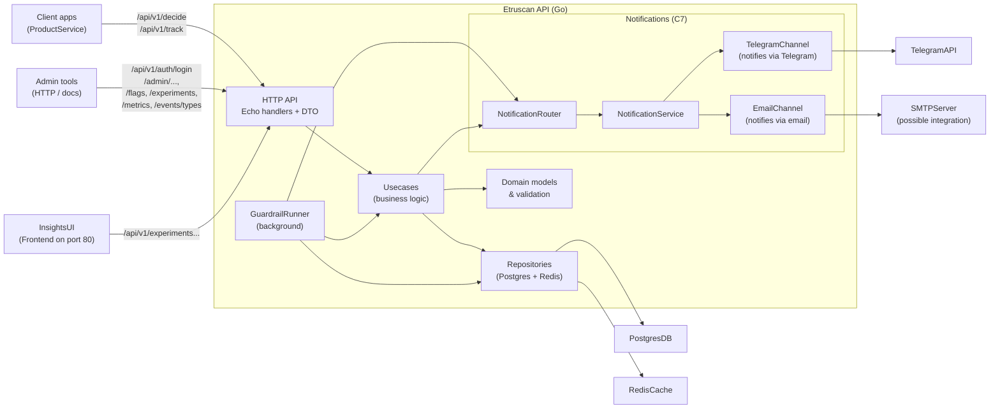
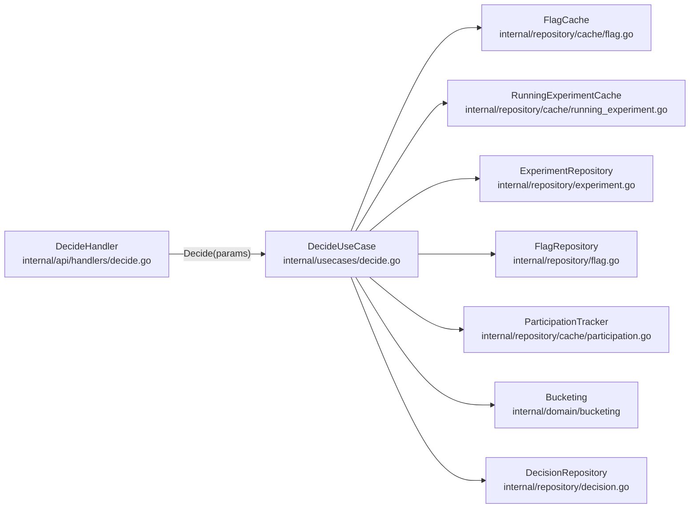
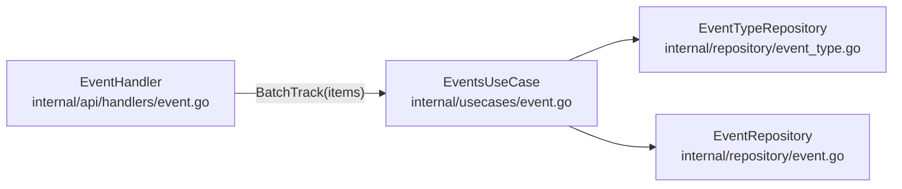
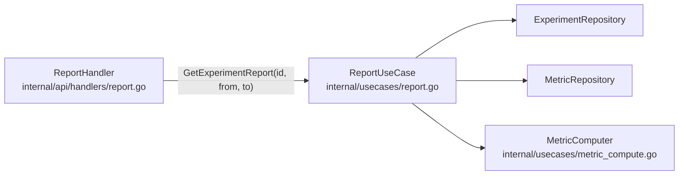
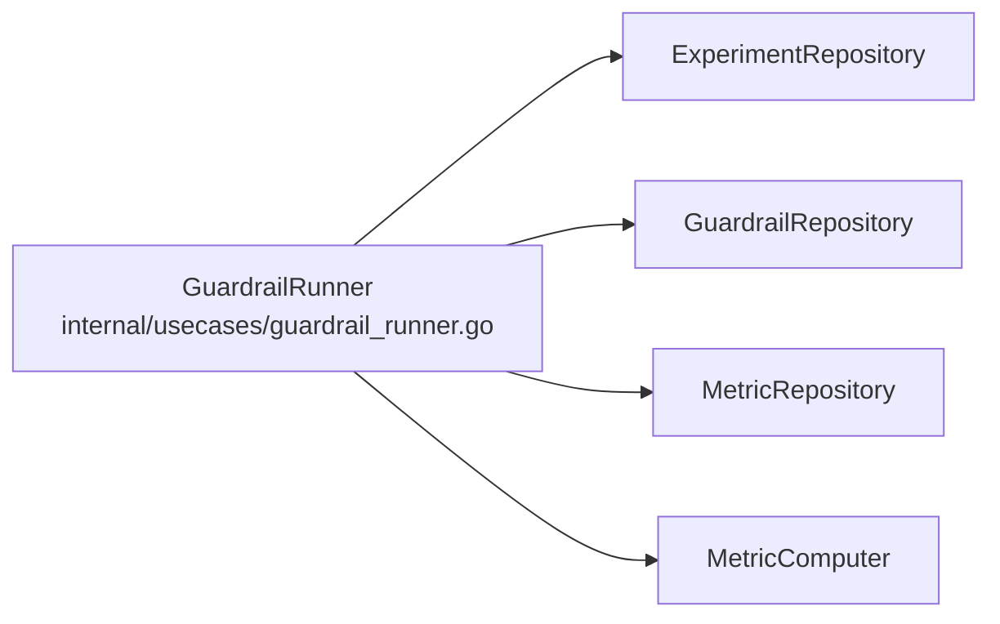

## Архитектура платформы Etruscan

_PARTIALLY OR FULLY AI GENERATED (but reviewed and refined by a human <3)_

---

## C4 Context (L1): внешние акторы и границы

- **ProductService** – любое клиентское приложение, которое:
  - запрашивает решения по флагам через `/api/v1/decide`;
  - отправляет события через `/api/v1/track`.
- **ExperimentAdmin** – пользователи платформы (PM, аналитики, админы и др. сотрудники), которые управляют:
  - флагами, экспериментами, метриками, типами событий, пользователями и approver‑группами.
- **Operator/SRE** – отвечает за эксплуатацию:
  - следит за `/api/v1/health`, `/api/v1/ready`, логами и метриками контейнера.
- **Etruscan** – эта платформа (`internal/app`, `internal/api`, `internal/usecases`, `internal/domain`, `internal/repository`).
- **PostgresDB** – основное хранилище всех доменных сущностей.
- **RedisCache** – кеш для быстрых путей (`decide`, ограничение участия, кеш флагов).
- **TelegramAPI** – Telegram Bots API (уведомления в Telegram).

---

## C4 Container (L2): сервисы и их ответственности

- **Etruscan API (Go)** – единый контейнер/процесс:
  - `APILayer` – Echo‑хендлеры (`internal/api/handlers`), DTO (`internal/api/dto`), маппинг домена -> HTTP.
  - `Usecases` – прикладная логика (`internal/usecases`): `DecideUseCase`, `ExperimentUseCase`, `GuardrailRunner` и т.д.
  - `Domain` – доменные модели и правила (`internal/domain/models`, `internal/domain/bucketing`).
  - `Repositories` – реализация доступа к Postgres и Redis (`internal/repository/*`, `internal/repository/cache/*`, `internal/database/generated`).
  - `GuardrailRunner` – фоновый процесс, периодически считающий метрики и guardrails.
- **PostgresDB** – хранит флаги, эксперименты, решения, события, метрики, guardrails, снэпшоты и историю статусов.
- **RedisCache** – хранит:
  - кеш флагов;
  - кеш запущенных экспериментов по ключу флага;
  - наборы активных экспериментов по пользователю (`user_active_exps:<userId>`).
- **TelegramAPI** – Telegram Bots API (уведомления в Telegram).
- **STMPServer** – SMTP-сервер (уведомления на электронную почту).
- 

---

## C4 Component (L3): критический путь `decide → track → report/guardrail`

### 1. Решение во время показа (`/api/v1/decide`)

Поток:

1. `DecideHandler.Decide` парсит запрос, валидирует DTO и вызывает `DecideUseCase.Decide`.
2. `DecideUseCase`:
   - читает флаг из кеша/БД (`getFlag`);
   - читает запущенный эксперимент по ключу флага из кеша/БД (`getRunningExperiment`, включая варианты):
     - если такого нет -> пользователь получает `defaultValue`;
   - вычисляет **bucket участия** по `userId`, `flagKey`, `experimentID` через `bucketing.HashAndBucket`:
     - если bucket ≥ `audiencePercentage` -> пользователь получает `defaultValue`;
   - через `ParticipationTracker.CanParticipate` ограничивает **одновременное** число экспериментов для пользователя;
   - вычисляет bucket варианта (отдельная соль `"variant"`) и выбирает вариант по весам через `bucketing.ChooseVariant`;
   - создаёт запись `Decision` в `DecisionRepository` (всегда – и для default, и для варианта).
3. Ответ хендлера содержит:
   - итоговое значение флага (`defaultValue` или `variant.Value`);
   - `id` решения (наш `decisionId` для атрибуции событий).

### 2. Приём событий (`/api/v1/track`)

Поток:

1. `EventHandler.BatchTrack`:
   - парсит список событий `BatchEventsRequest`;
   - вызывает `EventsUseCase.BatchTrack`.
2. `EventsUseCase.BatchTrack`:
   - валидирует обязательные поля (`eventId`, `eventTypeKey`, `userId`, `timestamp`) – B4‑2;
   - проверяет, что `eventTypeKey` существует в каталоге событий – B4‑1;
   - делает дедупликацию по `(eventTypeKey, client_event_id)` через `EventRepository.ExistsByTypeAndClientID` – B4‑3;
   - сохраняет новые события в БД (в том числе `decisionId` и свойства).
3. Возвращается агрегированный результат (`accepted`, `duplicates`, `rejected` и список ошибок).

### 3. Отчёты по эксперименту (`api/v1/experiments/{id}/report`)

Поток:

1. `ReportHandler.GetExperimentReport`:
   - валидирует идентификатор эксперимента и окно `[from, to)`;
   - передаёт параметры в `ReportUseCase`.
2. `ReportUseCase.GetExperimentReport`:
   - читает эксперимент и его варианты из репозитория;
   - получает список метрик, привязанных к эксперименту (`ListExperimentMetrics`);
   - для каждой метрики и варианта вызывает `MetricComputer.Compute`:
     - загружает решения и события в окне;
     - считает primitive/derived‑метрику;
   - возвращает структуру `ExperimentReport` с массивом `VariantMetricValues`.

### 4. Guardrails (фоновые safety‑проверки)

Поток:

1. `GuardrailRunner.Run` запускается при старте приложения (`internal/app/app.go`) как горутина с таймером.
2. Периодически:
   - выбирает все эксперименты в статусе `LAUNCHED`;
   - для каждого эксперимента читает список guardrails;
   - для каждого guardrail:
     - получает метрику из каталога;
     - считает значение метрики за окно (`now - windowSeconds .. now`) через `MetricComputer`;
     - сравнивает с порогом и проверяет направление (`upper`/`lower`);
     - при срабатывании:
       - обновляет статус эксперимента (`PAUSED`) или завершает его с исходом `ROLLBACK`;
       - создаёт запись о срабатывании в `GuardrailRepository.CreateTrigger`;
       - пишет структурированный лог.

Guardrails используют те же решения и события, что и отчёты, обеспечивая согласованность бизнес‑логики.

---

## Ограничения и упрощения (границы реализации)

Для честной оценки важно явно зафиксировать, что упрощено по сравнению с полным ТЗ:

- **Отправка уведомлений**: ввиду сложности настройки SMTP и ограниченного времени было принято решение оставить имплементацию Email-уведомлений в виде простых логов.
  - Telegram уведомления реализованы в полной мере.
- **Хранение и ретенция событий**:
  - События и решения хранятся в одной БД Postgres; продвинутые механизмы архивации/партиционирования указаны в операционном документе (`OPERATIONS.md`) как рекомендованные, но могут быть не полностью автоматизированы.

Все эти ограничения отражены также в `docs/TRACEABILITY_MATRIX.md` и могут быть показаны на демо как «известные границы» решения.

